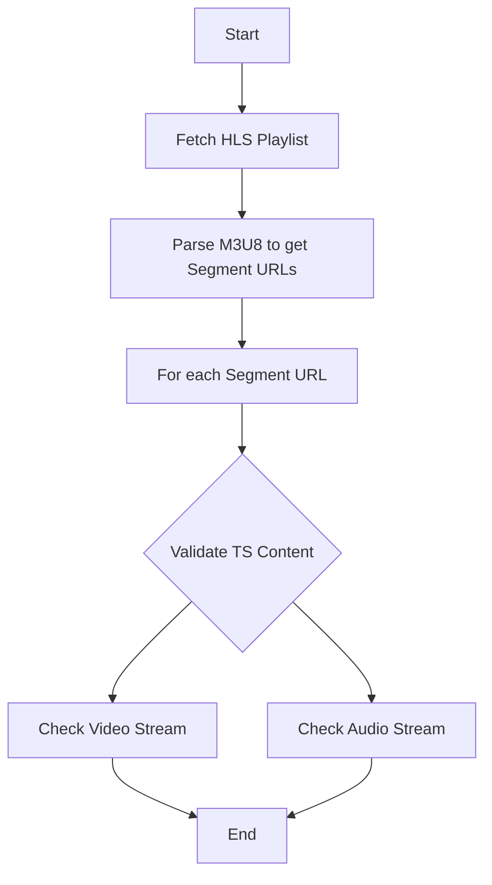

# HLS Stream Testing

This project is aimed at testing HLS (HTTP Live Streaming) .ts segments using Python. It fetches playlists, parses the M3U8 files, retrieves segment URLs, and then validates each segment's content to ensure both video and audio streams are present.

## Getting Started

1. Clone the repository:
```
git clone https://github.com/copyleftdev/testing-hls-fun.git
cd testing-hls-fun
```

2. Install the necessary dependencies:
```
pip install -r requirements.txt
```

3. Run the tests:
```
pytest -v
```

## Dependencies

- requests: Used for fetching HLS playlists and segments.
- pytest: For running tests.
- av: For validating video and audio streams in .ts segments.

## Flowchart


